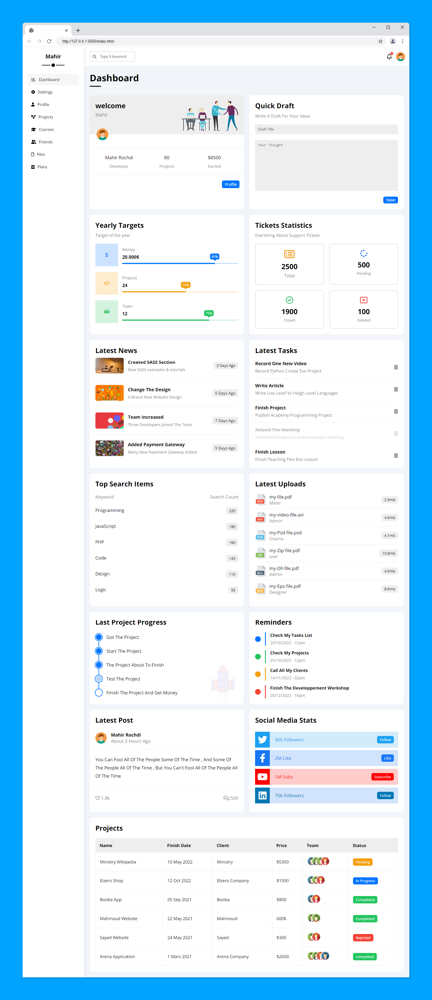
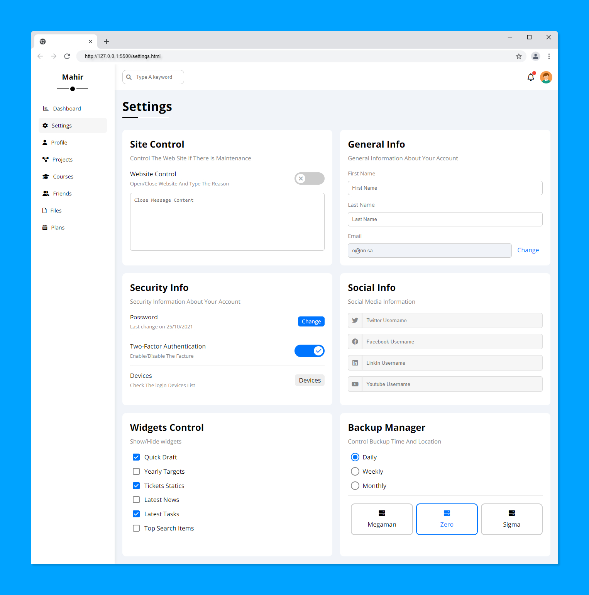
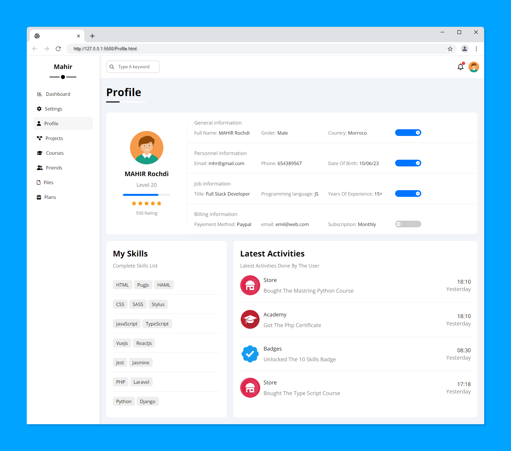
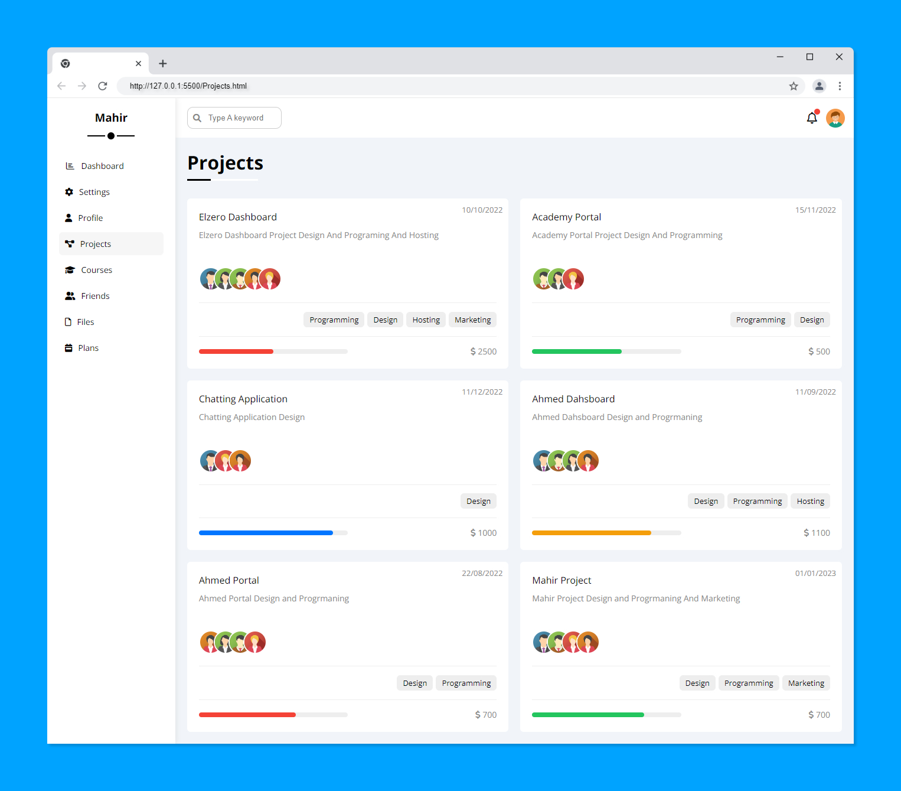
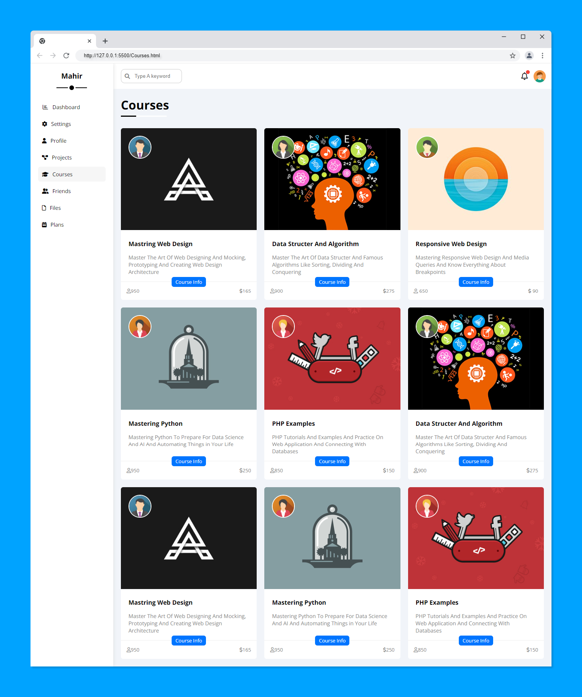
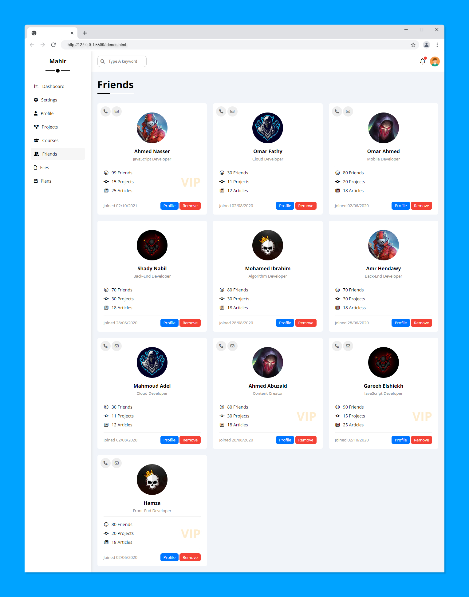
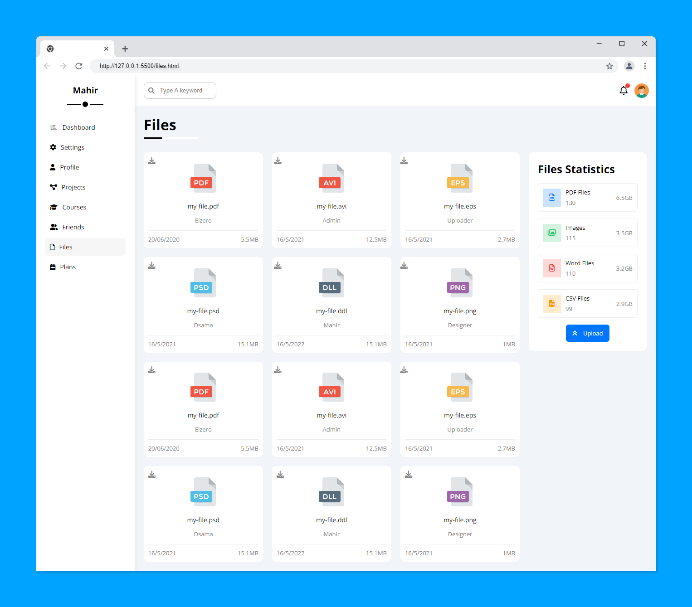
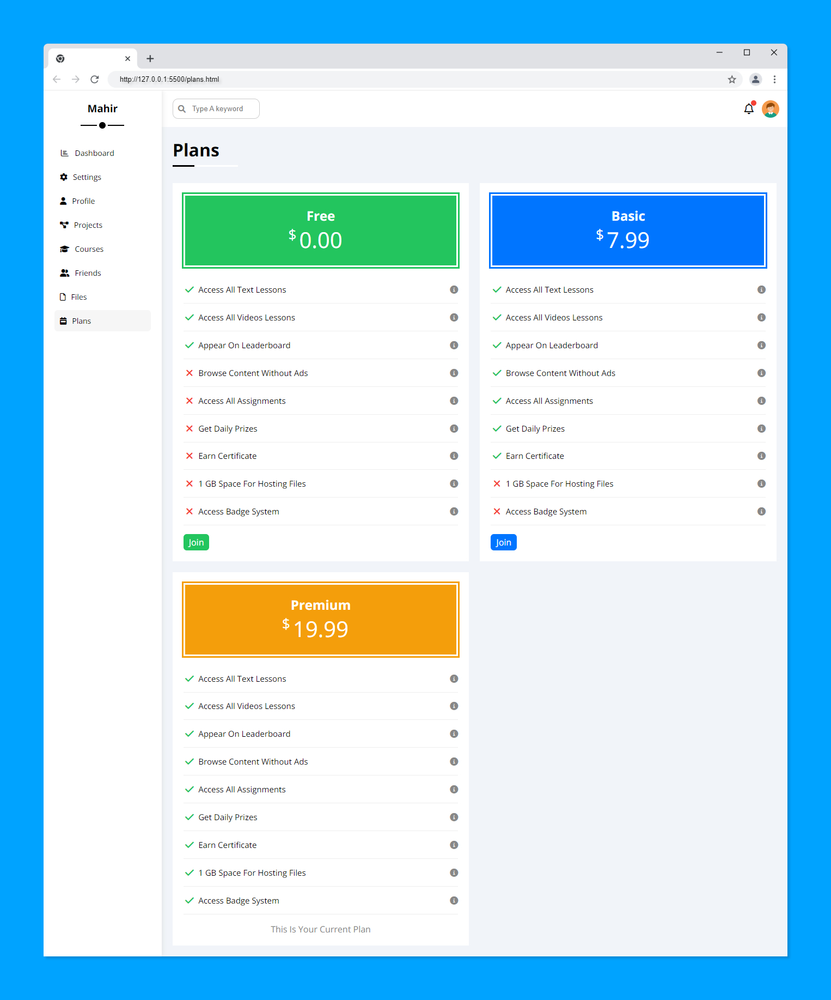
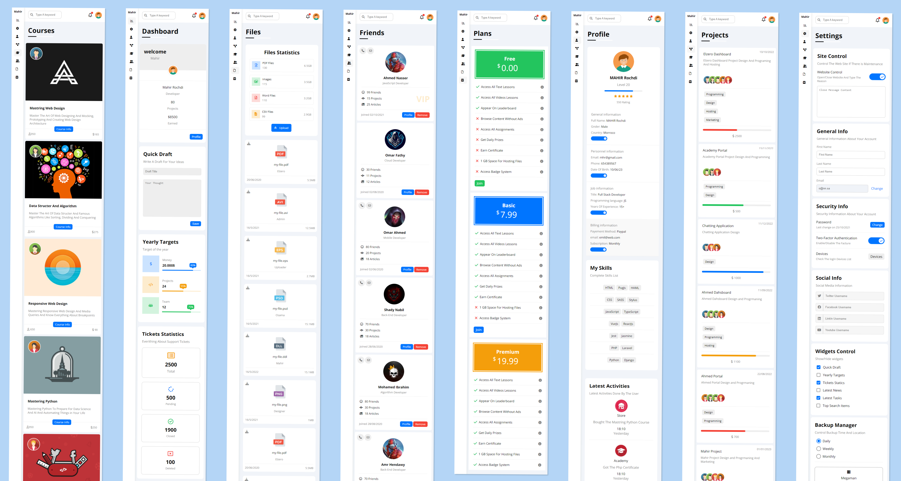

# Elzero Web School - Template 4 Solution
Happy to share my accomplishment with you all! I successfully completed The Template 4 from Elzero Web School Academy using HTML and CSS. I was able to create 8 pages, all with a responsive design. I even went a step further and created my own simple CSS framework for the project.

## Table of contents

- [Overview](#overview)
  - [Screenshot](#screenshots)
  - [Links](#links)
- [My process](#my-process)
  - [Built with](#built-with)
- [Author](#author)

## Overview

### Screenshots

### Links

- Live Site URL: [Mahir-ElzeroDashboard](https://mahirrochdi.github.io/ElzeroDashboard/)
- Template Source : [Template 4](https://elzero.org/html-css-template-4-preview/)
## My process

### Built with

- Html5
- CSS3

## Author

- Website - [Mahir Rochdi](https://github.com/MAHIRROCHDI)
- Linkedin - [@rochdi-mahir](www.linkedin.com/in/rochdi-mahir)
